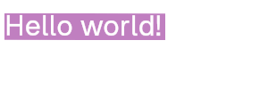
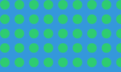
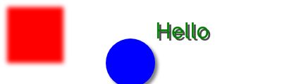
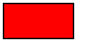
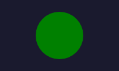
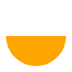
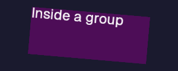
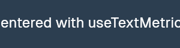
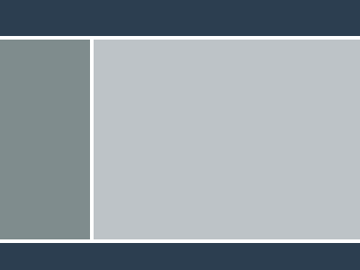

# react-tela

### Use React to render images, shapes and text to `<canvas>`

> [!WARNING]
> This package is currently under development. Expect breaking changes.

`react-tela` is a React renderer that draws components to a `<canvas>` node.

## Features

- **Low-level primitives** — base components expose Canvas drawing operations directly (rects, circles, arcs, paths, images, text)
- **High-level abstractions** — use the power of React to compose primitives into complex UIs
- **Flexbox layout** — optional `<Flex>` component powered by [Yoga](https://github.com/nicolo-ribaudo/yoga-wasm-web) for CSS-like layout
- **Unopinionated about runtime** — works in web browsers, Node.js, and [nx.js](https://github.com/TooTallNate/nx.js)
- **No DOM dependency** — never assumes anything "outside" of the provided canvas node

## Installation

```bash
npm install react-tela react
```

## Quick Start

```tsx
import React from "react";
import { Group, Rect, Text, useDimensions } from "react-tela";

function Contents() {
  const dims = useDimensions();
  return (
    <>
      <Rect width={dims.width} height={dims.height} fill="purple" alpha={0.5} />
      <Text fontSize={32} fontFamily="Geist" fill="white">
        Hello world!
      </Text>
    </>
  );
}

export function App() {
  return (
    <Group x={5} y={15} width={180} height={30} rotate={0.1}>
      <Contents />
    </Group>
  );
}
```



## Rendering

Import `render` from `react-tela/render` and pass your app component along with a canvas element:

### Web Browser

```tsx
import React from "react";
import { render } from "react-tela/render";
import { App } from "./App";

render(<App />, document.getElementById("canvas"));
```

### Node.js

Uses [`@napi-rs/canvas`](https://github.com/nicolo-ribaudo/napi-rs-canvas) for headless rendering:

```tsx
import React from "react";
import { render } from "react-tela/render";
import config, { Canvas } from "@napi-rs/canvas";
import { App } from "./App";

const canvas = new Canvas(300, 150);
await render(<App />, canvas, config);

const buffer = canvas.toBuffer("image/png");
// … do something with the PNG buffer
```

### nx.js

```tsx
import React from "react";
import { render } from "react-tela/render";
import { App } from "./App";

render(<App />, screen);
```

## Gradients

The `fill` and `stroke` props on shapes and text accept gradient descriptors in addition to CSS color strings. Use the gradient hooks inside components for optimal performance — they memoize the descriptor so the underlying `CanvasGradient` is cached across re-renders:

```tsx
import { Rect, Text, useLinearGradient, useRadialGradient, useConicGradient } from 'react-tela';

function GradientDemo() {
  // Linear gradient (memoized)
  const linear = useLinearGradient(0, 0, 200, 0, [
    [0, 'red'],
    [0.5, 'yellow'],
    [1, 'blue'],
  ]);

  // Radial gradient (memoized)
  const radial = useRadialGradient(100, 100, 10, 100, 100, 100, [
    [0, 'white'],
    [1, 'black'],
  ]);

  // Conic gradient (memoized)
  const conic = useConicGradient(0, 100, 100, [
    [0, 'red'],
    [0.25, 'yellow'],
    [0.5, 'green'],
    [0.75, 'blue'],
    [1, 'red'],
  ]);

  // Gradient on text
  const textGradient = useLinearGradient(0, 0, 300, 0, [[0, 'red'], [1, 'blue']]);

  return (
    <>
      <Rect width={200} height={100} fill={linear} />
      <Rect y={100} width={200} height={200} fill={radial} />
      <Rect y={300} width={200} height={200} fill={conic} />
      <Text y={500} fontSize={48} fill={textGradient}>Gradient Text</Text>
    </>
  );
}
```


### Gradient Hooks

| Hook | Parameters | Description |
|------|-----------|-------------|
| `useLinearGradient` | `(x0, y0, x1, y1, stops)` | Memoized linear gradient between two points |
| `useRadialGradient` | `(x0, y0, r0, x1, y1, r1, stops)` | Memoized radial gradient between two circles |
| `useConicGradient` | `(startAngle, x, y, stops)` | Memoized conic (sweep) gradient around a point |

Each `stops` parameter is an array of `[offset, color]` tuples where `offset` is between `0` and `1`.

## Patterns

The `<Pattern>` component creates a repeating pattern that can be used as a `fill` or `stroke` on shapes and text. It works like a `<Group>` but renders its children into an offscreen canvas and exposes a `CanvasPattern` via `ref`:

```tsx
import { Rect, Pattern } from 'react-tela';
import { useRef } from 'react';

function Checkerboard() {
  const pattern = useRef<CanvasPattern>(null);

  return (
    <>
      <Pattern ref={pattern} width={20} height={20} repetition="repeat">
        <Rect width={10} height={10} fill="#ccc" />
        <Rect x={10} y={10} width={10} height={10} fill="#ccc" />
      </Pattern>
      <Rect width={400} height={400} fill={pattern} />
    </>
  );
}
```


### Pattern Props

| Prop | Type | Default | Description |
|------|------|---------|-------------|
| `repetition` | `'repeat' \| 'repeat-x' \| 'repeat-y' \| 'no-repeat'` | `'repeat'` | How the pattern repeats |
| `width` | `number` | — | Width of the pattern tile |
| `height` | `number` | — | Height of the pattern tile |

The `<Pattern>` component also accepts all `<Group>` props. Pass the `ref` to `fill` or `stroke` on any shape or text component to apply the pattern.

### `usePattern()` Hook

For image URL-based patterns, use the `usePattern()` hook. It loads the image asynchronously and returns a `CanvasPattern` (or `null` while loading):

```tsx
import { Rect, usePattern } from 'react-tela';

function TiledBackground() {
  const pattern = usePattern('https://example.com/tile.png', 'repeat');

  return <Rect width={400} height={300} fill={pattern} />;
}
```



| Parameter | Type | Default | Description |
|-----------|------|---------|-------------|
| `source` | `string` | — | Image URL or path to load |
| `repetition` | `'repeat' \| 'repeat-x' \| 'repeat-y' \| 'no-repeat'` | `'repeat'` | How the pattern repeats |

Returns `CanvasPattern | null` — `null` while the image is loading.

## Filters

All entities support the `filter` prop, which maps directly to [`CanvasRenderingContext2D.filter`](https://developer.mozilla.org/en-US/docs/Web/API/CanvasRenderingContext2D/filter). Pass any valid CSS filter string:

```tsx
import { Rect, Circle, Text } from 'react-tela';

<Rect x={10} y={20} width={80} height={80} fill="red" filter="blur(3px)" />
<Circle x={115} y={25} radius={35} fill="blue" filter="drop-shadow(4px 4px 4px black)" />
<Text x={220} y={44} fill="green" fontSize={32} filter="drop-shadow(3px 3px 0 rgba(0,0,0,0.7))">
  Hello
</Text>
```



Supported filter functions include `blur()`, `brightness()`, `contrast()`, `drop-shadow()`, `grayscale()`, `hue-rotate()`, `invert()`, `opacity()`, `saturate()`, and `sepia()`. Multiple filters can be chained in a single string.

## Components

All components accept these common props:

| Prop | Type | Default | Description |
|------|------|---------|-------------|
| `x` | `number` | `0` | Horizontal position |
| `y` | `number` | `0` | Vertical position |
| `width` | `number` | `0` | Width in pixels |
| `height` | `number` | `0` | Height in pixels |
| `alpha` | `number` | `1` | Opacity (`0` = transparent, `1` = opaque) |
| `rotate` | `number` | `0` | Rotation in degrees |
| `scaleX` | `number` | `1` | Horizontal scale |
| `scaleY` | `number` | `1` | Vertical scale |
| `shadowColor` | `string` | — | Shadow color (CSS color string) |
| `shadowBlur` | `number` | `0` | Shadow blur radius |
| `shadowOffsetX` | `number` | `0` | Shadow horizontal offset |
| `shadowOffsetY` | `number` | `0` | Shadow vertical offset |

Mouse and touch events are supported on all components: `onClick`, `onMouseDown`, `onMouseUp`, `onMouseMove`, `onMouseEnter`, `onMouseLeave`, `onTouchStart`, `onTouchMove`, `onTouchEnd`.

### `<Rect>`

Draws a filled and/or stroked rectangle.

```tsx
<Rect x={10} y={10} width={100} height={50} fill="red" stroke="black" lineWidth={2} />
```



### `<RoundRect>`

Like `<Rect>` but with rounded corners.

```tsx
<RoundRect x={10} y={10} width={100} height={50} fill="blue" radii={10} />
```


The `radii` prop accepts a single number, a `DOMPointInit`, or an array — matching the [`CanvasRenderingContext2D.roundRect()`](https://developer.mozilla.org/docs/Web/API/CanvasRenderingContext2D/roundRect) spec.

### `<Circle>`

Draws a circle. Shorthand for `<Arc>` with `startAngle={0}` and `endAngle={360}`.

```tsx
<Circle x={100} y={100} radius={40} fill="green" />
```



### `<Ellipse>`

Draws an ellipse with separate X and Y radii.

```tsx
<Ellipse x={10} y={10} radiusX={80} radiusY={40} fill="purple" stroke="white" lineWidth={2} />
```


| Prop | Type | Default | Description |
|------|------|---------|-------------|
| `radiusX` | `number` | — | Horizontal radius |
| `radiusY` | `number` | — | Vertical radius |
| `ellipseRotation` | `number` | `0` | Ellipse rotation in degrees |
| `startAngle` | `number` | `0` | Start angle in degrees |
| `endAngle` | `number` | `360` | End angle in degrees |
| `counterclockwise` | `boolean` | `false` | Draw counterclockwise |

### `<Arc>`

Draws an arc or partial circle.

```tsx
<Arc x={100} y={100} radius={50} startAngle={0} endAngle={180} fill="orange" />
```



| Prop | Type | Description |
|------|------|-------------|
| `radius` | `number` | Arc radius |
| `startAngle` | `number` | Start angle in degrees |
| `endAngle` | `number` | End angle in degrees |
| `counterclockwise` | `boolean` | Draw counterclockwise |

### `<Path>`

Draws an SVG path.

```tsx
<Path
  x={50} y={50}
  width={48} height={48}
  d="M26.285,2.486l5.407,10.956..."
  fill="#ED8A19"
  stroke="red"
  lineWidth={3}
  scaleX={2} scaleY={2}
/>
```

| Prop | Type | Description |
|------|------|-------------|
| `d` | `string` | SVG path data string |
| `width` | `number` | Required. Path viewport width |
| `height` | `number` | Required. Path viewport height |


### `<Line>`

Draws a line or polyline through a series of points.

```tsx
<Line points={[{ x: 10, y: 80 }, { x: 70, y: 10 }, { x: 140, y: 80 }]} stroke="blue" lineWidth={3} />
```


| Prop | Type | Description |
|------|------|-------------|
| `points` | `{x: number, y: number}[]` | Array of points to connect |

Width and height are computed automatically from the bounding box of the points. All [shape props](#shape-props) are supported (stroke, lineWidth, fill, etc.).

### `<Image>`

Renders an image from a URL or file path. The image loads asynchronously — the component renders at the specified (or natural) dimensions once loaded.

```tsx
<Image src="/path/to/image.png" x={10} y={10} width={200} height={150} />
```

| Prop | Type | Description |
|------|------|-------------|
| `src` | `string` | Image source (URL or file path) |
| `sx`, `sy`, `sw`, `sh` | `number` | Source crop rectangle (optional) |

### `<Text>`

Renders text.

```tsx
<Text x={10} y={10} fontSize={24} fontFamily="Geist" fill="white" stroke="black">
  Hello world!
</Text>
```

| Prop | Type | Default | Description |
|------|------|---------|-------------|
| `children` | `string \| number` | — | Text content |
| `fontSize` | `number` | `24` | Font size in pixels |
| `fontFamily` | `string` | `"sans-serif"` | Font family |
| `fontWeight` | `string` | `""` | Font weight |
| `fill` | `string` | — | Fill color |
| `stroke` | `string` | — | Stroke color |
| `lineWidth` | `number` | — | Stroke width |
| `textAlign` | `CanvasTextAlign` | `"start"` | Horizontal alignment |
| `textBaseline` | `CanvasTextBaseline` | `"top"` | Vertical baseline |


### `<Group>`

Groups child components into a sub-canvas with its own coordinate system. Children render relative to the group's position.

```tsx
<Group x={50} y={50} width={200} height={100} rotate={5}>
  <Rect width={200} height={100} fill="purple" alpha={0.5} />
  <Text fontSize={24} fill="white">Inside a group</Text>
</Group>
```



### `<Canvas>`

Creates a sub-canvas that you can draw to imperatively via `getContext('2d')`. Useful for mixing imperative canvas drawing with React components.

```tsx
function CustomCanvas() {
  return (
    <Canvas
      width={100}
      height={100}
      ref={(canvas) => {
        if (!canvas) return;
        const ctx = canvas.getContext("2d");
        ctx.fillStyle = "blue";
        ctx.fillRect(0, 0, 50, 50);
      }}
    />
  );
}
```


### Shape Props

`<Rect>`, `<RoundRect>`, `<Circle>`, `<Ellipse>`, `<Arc>`, `<Path>`, and `<Line>` all share these shape-specific props:

| Prop | Type | Description |
|------|------|-------------|
| `fill` | `string` | Fill color |
| `fillRule` | `CanvasFillRule` | Fill rule (`"nonzero"` or `"evenodd"`) |
| `stroke` | `string` | Stroke color |
| `lineWidth` | `number` | Stroke width (default: `1`) |
| `lineCap` | `CanvasLineCap` | Line cap style |
| `lineJoin` | `CanvasLineJoin` | Line join style |
| `lineDash` | `number[]` | Dash pattern |
| `lineDashOffset` | `number` | Dash offset |
| `miterLimit` | `number` | Miter limit |
| `clip` | `boolean` | Clip children to this shape |
| `clipRule` | `CanvasFillRule` | Clip rule |

## Hooks

### `useDimensions()`

Returns `{ width, height }` of the parent canvas or group.

```tsx
function FullSizeRect() {
  const { width, height } = useDimensions();
  return <Rect width={width} height={height} fill="black" />;
}
```

### `useLayout()`

Returns `{ x, y, width, height }` from the nearest `LayoutContext`. Used internally by components to support the `<Flex>` layout system.

### `useParent()`

Returns the parent `Root` context. Useful for advanced use cases like accessing the underlying canvas context or queuing manual re-renders.

### `useTextMetrics(text, fontFamily?, fontSize?, fontWeight?)`

Measures text and returns a [`TextMetrics`](https://developer.mozilla.org/docs/Web/API/TextMetrics) object. Useful for positioning or sizing based on text content.

```tsx
function CenteredText({ children }: { children: string }) {
  const dims = useDimensions();
  const metrics = useTextMetrics(children, "Geist", 24);
  return (
    <Text
      x={dims.width / 2 - metrics.width / 2}
      y={dims.height / 2 - 12}
      fontSize={24}
      fontFamily="Geist"
      fill="white"
    >
      {children}
    </Text>
  );
}
```



## Flex Layout

The `<Flex>` component provides CSS Flexbox-like layout powered by the [Yoga](https://github.com/nicolo-ribaudo/yoga-wasm-web) layout engine. It calculates positions and sizes for child components and feeds them through `LayoutContext`, so standard components like `<Rect>` automatically receive the correct position and dimensions.

### Setup

```bash
npm install yoga-wasm-web
```

```tsx
import initYoga from "yoga-wasm-web/asm";
import { createFlex } from "react-tela/flex";

const yoga = initYoga();
const Flex = createFlex(yoga);
```

`createFlex()` is a factory that takes an initialized Yoga instance and returns a `<Flex>` component. This avoids a hard runtime dependency on Yoga — you bring your own.

### Basic Usage

```tsx
// Three equal columns
<Flex width={300} height={100} flexDirection="row" gap={10}>
  <Flex flex={1}><Rect fill="red" /></Flex>
  <Flex flex={1}><Rect fill="green" /></Flex>
  <Flex flex={1}><Rect fill="blue" /></Flex>
</Flex>
```


### Nesting

Build complex layouts by nesting `<Flex>` components:

```tsx
// Classic app layout: header, sidebar + content, footer
<Flex width={800} height={600} flexDirection="column" gap={10}>
  <Flex height={50}>
    <Rect fill="#2c3e50" />
  </Flex>
  <Flex flex={1} flexDirection="row" gap={10}>
    <Flex width={200}>
      <Rect fill="#7f8c8d" />
    </Flex>
    <Flex flex={1}>
      <Rect fill="#bdc3c7" />
    </Flex>
  </Flex>
  <Flex height={40}>
    <Rect fill="#2c3e50" />
  </Flex>
</Flex>
```



### `Flex.Text`

For text within a flex layout, use `Flex.Text` — it measures the text and creates a correctly-sized flex node:

```tsx
<Flex alignItems="center" gap={10}>
  <Flex width={40} height={40}><Circle fill="blue" radius={20} /></Flex>
  <Flex.Text fontSize={24} fontFamily="Geist" fill="white">
    Hello Flex!
  </Flex.Text>
</Flex>
```


### Flex Props

#### Container Props

| Prop | Type | Default | Description |
|------|------|---------|-------------|
| `flexDirection` | `"row" \| "column" \| "row-reverse" \| "column-reverse"` | `"column"` | Main axis direction |
| `flexWrap` | `"no-wrap" \| "wrap" \| "wrap-reverse"` | `"no-wrap"` | Whether children wrap |
| `justifyContent` | `"flex-start" \| "center" \| "flex-end" \| "space-between" \| "space-around" \| "space-evenly"` | `"flex-start"` | Main axis alignment |
| `alignItems` | `"flex-start" \| "center" \| "flex-end" \| "stretch" \| "baseline" \| "auto"` | `"stretch"` | Cross axis alignment |
| `gap` | `number` | — | Gap between children (all axes) |

#### Item Props

| Prop | Type | Description |
|------|------|-------------|
| `alignSelf` | Same as `alignItems` | Override parent's `alignItems` for this child |
| `flex` | `number` | Shorthand for grow/shrink/basis |
| `flexGrow` | `number` | How much this item grows to fill space |
| `flexShrink` | `number` | How much this item shrinks |
| `flexBasis` | `number \| string` | Initial size before growing/shrinking |

#### Dimensions

| Prop | Type | Description |
|------|------|-------------|
| `width` | `number \| string` | Width (number for pixels, string like `"50%"` for percentage, `"auto"`) |
| `height` | `number \| string` | Height |
| `minWidth` | `number \| string` | Minimum width |
| `maxWidth` | `number \| string` | Maximum width |
| `minHeight` | `number \| string` | Minimum height |
| `maxHeight` | `number \| string` | Maximum height |

#### Spacing

| Prop | Type | Description |
|------|------|-------------|
| `margin` | `number` | Margin on all edges |
| `marginTop` | `number` | Top margin |
| `marginBottom` | `number` | Bottom margin |
| `marginLeft` | `number` | Left margin |
| `marginRight` | `number` | Right margin |
| `padding` | `number` | Padding on all edges |
| `paddingTop` | `number` | Top padding |
| `paddingBottom` | `number` | Bottom padding |
| `paddingLeft` | `number` | Left padding |
| `paddingRight` | `number` | Right padding |

#### Positioning

| Prop | Type | Default | Description |
|------|------|---------|-------------|
| `position` | `"relative" \| "absolute" \| "static"` | `"relative"` | Position type |
| `top` | `number` | — | Top offset |
| `bottom` | `number` | — | Bottom offset |
| `left` | `number` | — | Left offset |
| `right` | `number` | — | Right offset |

#### Other

| Prop | Type | Description |
|------|------|-------------|
| `display` | `"flex" \| "none"` | Display mode |
| `overflow` | `"visible" \| "hidden" \| "scroll"` | Overflow behavior |
| `aspectRatio` | `number` | Aspect ratio |

## Exports

| Entry Point | Exports |
|------------|---------|
| `react-tela` | `Rect`, `RoundRect`, `Circle`, `Ellipse`, `Arc`, `Path`, `Line`, `Image`, `Text`, `Group`, `Canvas`, `useDimensions`, `useLayout`, `useParent`, `useTextMetrics`, `LayoutContext` |
| `react-tela/render` | `render` |
| `react-tela/flex` | `createFlex` |

## What is "tela"? 🇧🇷

The word "tela" is the Portuguese word for "canvas" or "screen".

> **tela** \[ˈtɛla\] _(feminine noun)_
>
> 1. (_de pintar_) canvas
> 2. (_cinema_, _telecommunications_) screen

Since the name `react-canvas` was already taken, `react-tela` was a fun alternative.

## Prior Art

A few other React renderers for `<canvas>` already exist, so why another?

`react-tela` is designed to make as few assumptions about the runtime environment as possible. Other renderers assume they are running in a web browser, or possibly Node.js. This module only interacts with the canvas node it is provided, and never makes any assumptions about anything "outside" of the node.

- [`react-art`](https://www.npmjs.com/package/react-art) — Appears to be an official solution (code lives in the React monorepo), but documentation and examples are basically non-existent and it does not seem to be actively maintained.
- [`react-canvas`](https://www.npmjs.com/package/react-canvas) — Perfect name. Nice API. Probably one of the original React `<canvas>` implementations. Has not been updated in years.
- [`react-konva`](https://www.npmjs.com/package/react-konva) — Awesome and very mature. Relies on `react-dom`, which is pretty large and assumes a DOM is available.

## License

MIT
