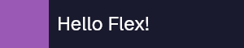

# @react-tela/flex

### CSS Flexbox layout for react-tela, powered by [Yoga](https://github.com/facebook/yoga)

> [!WARNING]
> This package is currently under development. Expect breaking changes.

`@react-tela/flex` provides a `<Flex>` component that brings CSS Flexbox layout to [`react-tela`](https://github.com/TooTallNate/react-tela) canvas rendering. It uses [`yoga-wasm-web`](https://github.com/shuding/yoga-wasm-web) under the hood to compute layouts.

## Installation

```bash
npm install @react-tela/flex react-tela react
```

## Quick Start

```tsx
import React from "react";
import { Rect } from "react-tela";
import initYoga from "yoga-wasm-web/asm";
import { createFlex } from "@react-tela/flex";

const yoga = initYoga();
const Flex = createFlex(yoga);

export function App() {
  return (
    <Flex width={300} height={100} flexDirection="row" gap={10}>
      <Flex flex={1}><Rect fill="#e74c3c" /></Flex>
      <Flex flex={1}><Rect fill="#2ecc71" /></Flex>
      <Flex flex={1}><Rect fill="#3498db" /></Flex>
    </Flex>
  );
}
```


## API

### `createFlex(yogaInstance)`

Creates a `Flex` component bound to the given Yoga instance. Returns a component that accepts all standard CSS Flexbox properties:

- **Direction & wrap:** `flexDirection`, `flexWrap`
- **Alignment:** `justifyContent`, `alignItems`, `alignSelf`
- **Sizing:** `flex`, `flexGrow`, `flexShrink`, `flexBasis`
- **Dimensions:** `width`, `height`, `minWidth`, `maxWidth`, `minHeight`, `maxHeight` (numbers or percentage strings)
- **Spacing:** `gap`, `margin`, `padding` (and per-edge variants)
- **Positioning:** `position` (`"relative"` | `"absolute"`), `top`, `left`, `right`, `bottom`
- **Other:** `display`, `overflow`, `aspectRatio`

### `Flex.Text`

A subcomponent for auto-measured text within Flex layouts:

```tsx
<Flex.Text fontFamily="Geist Sans" fontSize={24} fill="white">
  Hello Flex!
</Flex.Text>
```



## Nested Layouts

Flex components nest naturally — the outermost `<Flex>` becomes the layout root:

```tsx
<Flex width={300} height={300} flexDirection="column" gap={10}>
  <Flex height={50}><Rect fill="#2c3e50" /></Flex>
  <Flex flex={1} flexDirection="row" gap={10}>
    <Flex width={80}><Rect fill="#7f8c8d" /></Flex>
    <Flex flex={1}><Rect fill="#bdc3c7" /></Flex>
  </Flex>
  <Flex height={40}><Rect fill="#34495e" /></Flex>
</Flex>
```


