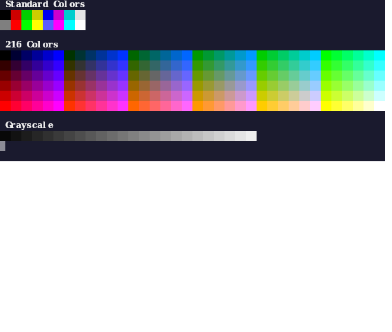

# @react-tela/terminal

A [react-tela](https://github.com/TooTallNate/react-tela) component that renders a terminal emulator on a Canvas2D surface using [xterm.js](https://xtermjs.org/) (headless).

## Features

- 🖥️ Full terminal emulation via `@xterm/headless`
- 🎨 ANSI 256-color support
- ✨ Inherits all react-tela entity props: `alpha`, `rotate`, `scaleX/Y`, `shadow`, `filter`, `blendMode`
- 📐 Auto-calculates `cols`/`rows` from dimensions, or set them explicitly
- 🔄 Dynamic resizing — adapts when width/height change (e.g. inside `<Flex>`)
- ⌨️ Async `write()` that resolves when xterm has processed the data

## Usage

```tsx asset="example-usage" width=380 height=90
import React, { useEffect, useRef } from "react";
import { Terminal, TerminalEntity } from "./src/index.js";

export function App() {
  const ref = useRef<TerminalEntity>(null);

  useEffect(() => {
    const term = ref.current;
    if (!term) return;
    term.write("Hello, terminal!\r\n");
    term.write("\x1b[32mGreen text\x1b[0m ");
    term.write("\x1b[31mRed text\x1b[0m ");
    term.write("\x1b[34mBlue text\x1b[0m\r\n");
    term.write("\x1b[1mBold\x1b[0m \x1b[4mUnderline\x1b[0m \x1b[7mInverse\x1b[0m\r\n");
    term.write("\x1b[?25l"); // hide cursor
  }, []);

  return (
    <Terminal
      ref={ref}
      fontSize={14}
      fontFamily="Geist Mono"
      theme={{ background: "#1e1e1e", foreground: "#d4d4d4", cursor: "transparent" }}
    />
  );
}
```


## ANSI Colors

The terminal supports the full ANSI 256-color palette:

```tsx asset="example-colors" width=660 height=270
import React, { useEffect, useRef } from "react";
import { Terminal, TerminalEntity } from "./src/index.js";

export function App() {
  const ref = useRef<TerminalEntity>(null);

  useEffect(() => {
    const term = ref.current;
    if (!term) return;
    term.write("\x1b[1m Standard Colors \x1b[0m\r\n");
    for (let i = 0; i < 8; i++) {
      term.write(`\x1b[48;5;${i}m  \x1b[0m`);
    }
    term.write("\r\n");
    for (let i = 8; i < 16; i++) {
      term.write(`\x1b[48;5;${i}m  \x1b[0m`);
    }
    term.write("\r\n\r\n\x1b[1m 216 Colors \x1b[0m\r\n");
    for (let i = 16; i < 232; i++) {
      term.write(`\x1b[48;5;${i}m  \x1b[0m`);
      if ((i - 15) % 36 === 0) term.write("\r\n");
    }
    term.write("\r\n\x1b[1m Grayscale \x1b[0m\r\n");
    for (let i = 232; i < 256; i++) {
      term.write(`\x1b[48;5;${i}m  \x1b[0m`);
    }
    term.write("\r\n");
    term.write("\x1b[?25l"); // hide cursor
  }, []);

  return (
    <Terminal
      ref={ref}
      fontSize={14}
      fontFamily="Geist Mono"
      theme={{ background: "#1a1a2e", foreground: "#eee", cursor: "transparent" }}
    />
  );
}
```



## Props

| Prop | Type | Default | Description |
|------|------|---------|-------------|
| `cols` | `number` | Auto from width | Number of columns |
| `rows` | `number` | Auto from height | Number of rows |
| `fontSize` | `number` | `16` | Font size in pixels |
| `fontFamily` | `string` | `"monospace"` | Font family |
| `charWidth` | `number` | Auto | Character width in pixels |
| `lineHeight` | `number` | Auto | Line height in pixels |
| `theme` | `ITheme` | `{}` | xterm.js theme object |
| `scrollback` | `number` | `500` | Scrollback buffer size |
| `onData` | `(data: string) => void` | — | Terminal output data callback |
| `onResize` | `(cols: number, rows: number) => void` | — | Resize callback |

Plus all standard [react-tela entity props](https://github.com/TooTallNate/react-tela) (`x`, `y`, `width`, `height`, `alpha`, `rotate`, etc.).

## Ref Methods

Access the terminal entity via `ref`:

```tsx
const ref = useRef<TerminalEntity>(null);

// Write data (async — resolves when processed)
await ref.current.write('Hello\r\n');

// Access the underlying xterm.js instance
ref.current.terminal.scrollToBottom();
```

## Installation

```bash
npm install @react-tela/terminal react-tela
```

## License

MIT
